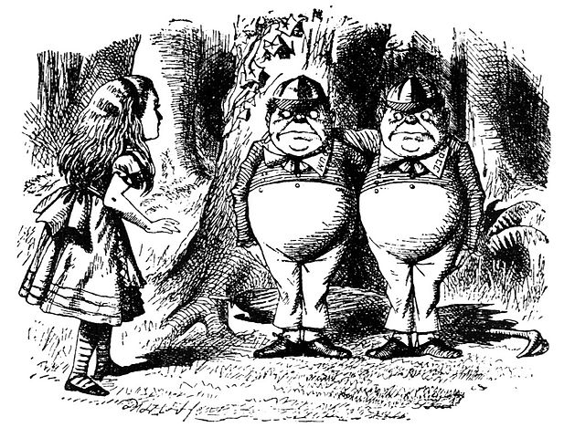

# A Little bit of logic

```{block, type="epigraph"}
‘Contrariwise,’ continued Tweedledee, ‘if it was so, it might be; and if it were so, it would be; but as it isn’t, it ain’t. That’s logic.’\
---Lewis Carroll, Through the Looking Glass
```


```{marginfigure}

John Tenniel, "Alice meets Tweedle Dee and Tweedle Dum"
```

`r newthought("Logic")` is the formal study of one aspect of our use of language – the attempt to justify or provide evidence for claims or beliefs as expressed in arguments. In this chapter we will look at the basic concepts and techniques for the logical analysis of arguments. As we will be seeing these will be very useful in our discussions of ethics since much of what we will be doing will involve careful consideration of the justification of claims we make about ethics in general as well as particular topics in ethics.

Before we get started though we need to clarify some terminology – especially our use of the word "argument." Too often this word conjures up a pointless verbal fight between people with opposed views. They argue rather than discuss because their differences of opinion are fixed in place and neither will budge. It is typically a good idea to stay away from arguments in this sense. The word argument as we are using it here, however, has quite a different meaning. For us arguments do not require differences of opinion because arguments are just attempts to explicitly provide back-up or justification for some claim that we might make. We offer arguments in this sense whenever we make the grounds for our belief explicit whether we are doing this within the confines of our own heads, in written form or spoken out loud whether or not anyone disagrees with us. Of course oftentimes arguments in this sense of the term might be given by people claiming to justify different views about some topic or other. But as we will be seeing arguments are best looked at one at a time and not necessarily in comparison with other arguments.

For philosophers, we offer arguments as attempts to provide support for whatever it is that we want to claim is true. For example, maybe we happen to believe that the death penalty is wrong, or maybe we believe the opposite. Or we might believe that the government should cut all social services programs that help the poor, or we might believe the opposite. Or we may believe that ethical principles are relative to different cultures and that there are thus no ethical principles that are universally valid; or again, we might believe the opposite. We can of course believe whatever it is that we want. That will, however, only get us so far – either others will agree with us or not. But we can also offer reasons in support of our claims in the form of arguments. As we will be seeing, not all arguments are equally persuasive, but there are clear cut and reliable ways of evaluating them to see which really provide the support we are after and which do not.

## Arguments, Rationality and Rhetoric

```{marginfigure}

John Tenniel, "The Mad Hatter"
```

`r newthought ("Arguments")` are attempts to persuade other people that they should accept the claims that we are making. Because argumentation is a method of persuasion it may seem at first glance to be similar to rhetoric, also known as “the art of persuasion.” People who study and practice rhetoric often claim that rational argument is just one among many different methods of persuasion, appropriate at specific times, but not fundamentally different than other methods. That is, they claim that argument is a form of rhetoric. Philosophers, on the other hand, would like to insist on the basic difference between the two. Philosophers call attention to the fact that in rhetoric:

- Appeal is made to our emotions, prejudices, fears, hopes, etc. That is, who we are and what we feel about things matters. This is its strength (advertisers use such appeals all the time) and its weakness (you will have a hard time persuading someone with lung cancer to take up smoking, because they have concerns that cigarette advertisers assume that we don’t have when they try to sell us cigarettes).

- Because of this, the persuasion that rhetoric produces doesn’t last, once our feelings change, we are no longer convinced, and our feelings are constantly changing.

In rational argument, on the other hand:

- Appeal is made not to our emotions but to our ability to reason.

- Since everyone is equally capable of reasoning, this means that arguments do not appeal to us personally. It doesn’t matter who you are, a good argument will convince you.

## The Structure of Arguments

```{marginfigure}

John Tenniel, "Alice and the Red and White Queens"
```

`r newthought ("To see")` all of this more clearly, we need to take a look at how arguments work. But first we should define what we mean by an argument. An argument is a series of statements including at least one premise and a conclusion. The premises are where we start, the conclusion is where we end up. In a good argument the premises must lead us necessarily to the conclusion. More on this shortly.

Arguments are sets of statements: this means that when we are concerned with arguments we are not paying attention to many other uses of language, such as asking questions, making commands, expressing feelings. When we are offering an argument we are simply making a series of claims in which some are supposed to provide support for others. The statements that are doing the supporting, which contain the information that is the basis of our argument are known as premises. The statement that is being supported, the point of our argument is called the conclusion.

It is sometimes difficult to tell whether a set of sentences is an argument or not. Let us consider a few examples:

```{block, type="argument", echo=TRUE}
Parents should have the right to make decisions about their own children.\
Why should other people mess around in their business?\
And please keep those lawyers out!
```

This may seem like an argument, so how can we tell for sure? Simply by asking ourselves whether this set of sentences is a set of statements where some are supposed to support the others. So, how many statements are there here? Only one: the first sentence is a statement, the second is a question and the third is a command. In other words, even though this looks at first like an argument it is really just a single claim with no real argument given in support. It is truly amazing what people will try to get away with.

What about the next example? How many statements are in these sentences? And do any of them really offer support for any of the others?

```{block, type="argument", echo=TRUE}
I am convinced that aliens are living among us and you should be convinced as well.\
I have really good evidence for this claim.
```

Well this is almost an argument, but not quite. There is a claim being made here: aliens are living among us. But there is no real support given for this claim, only the insistence that this person has some unknown evidence. Before we can start to evaluate this evidence to see whether it really supports the claim, we need to see it. So here we have only two separate statements without a real argument yet.

OK, none of these sets of sentences have yet been real arguments even if they might have seemed to be at first glance. Now consider the following example:

```{block, type="argument", echo=TRUE}
Christopher Columbus was a criminal, because anyone who kills innocent people, kidnaps others, and steals their valuables is a criminal and that is just what he did.
```

Here the grammatical form is a little misleading. This is an argument in spite of the fact that there is only one sentence. Why? Because this one sentence expresses a few different claims and some of these claims are offered as supports for others. We can see this if we break it up into individual claims and change the order around like so:

```{block, type="argument", echo=TRUE}
Anyone who kills people, kidnaps other people and steals their valuables is a criminal.\
Christopher Columbus did all of these things.\
<hr> 
So Christopher Columbus was a criminal.
```

Perhaps this is not yet a very convincing argument, but at least it is an argument unlike the first examples.

It is not always so clear which statements in an argument are the premises and which statement is the conclusion. Often, but not always, these are signaled with one of a number of typical words or phrases that function as premise or conclusion indicators. Paying attention to these typical words and phrases can help you to disentangle the argument from the peculiarities of a writer’s style.


### premises {-}

It is often the case that arguments are presented with the conclusion first to emphasize to the audience where things are leading. The following common words are often used to indicate what is playing the logical role of conclusion.

- Because
- Since
- In light of the fact that
- In view of the following evidence

This is not an exhaustive list. Basically, when reading an argument you can pick out the premises by asking yourself where the writer is starting from and where he or she is going. The first is the set of premises and the second is the conclusion.

### conclusions {-}

- Therefore
- It follows that
- Thus
- It should be clear that

These words and phrases indicate that this is where the writer (or speaker) is going with the argument. Notice that in many actual arguments the conclusion is given first, as when a lawyer begins her argument in court with the claim, "Your honor, ladies and gentlemen of the jury, my client is not guilty," and then goes on to present the evidence. For the sake of analyzing an argument philosophers like to clarify its logical structure by writing it in standard form.

### pattern of reasoning {-}

One other thing to watch for when looking at arguments is words and phrases that indicate the structure of the reasoning itself. These are ways of pointing out exactly how the premises are supposed to support the conclusion, indicators of the pattern or form of reasoning involved.

- because of these, that has to be true
- if this then that, otherwise...
- all of the above so...
- this is the only option that works
- if we assume that this is true we get a ridiculous result so it can’t be true

These indicate the general logic form of argument being followed. Is it a matter of necessity, other conditions present or absent, summation of influences, or a process of elimination, or are we showing something indirectly by showing that denying it makes no sense? The more formal study of logic looks carefully at these and many other different patterns of reasoning.

## Validity and Soundness

```{marginfigure}

John Tenniel, "Alice Meets Humpty"
```

`r newthought ("Not all")` arguments are equal. Just because we have an arbitrary set of premises supporting some random conclusion doesn’t mean that we should feel ourselves compelled to buy this conclusion. Instead, as we will see, there are some arguments that really are better than others. Really good arguments are compelling on their own, and we should, as long as we are being rational, have no choice but to accept them. For the skeptics out there who doubt that we will ever be able to create such an argument, I should also point out that the clearest and best arguments really don’t end up saying anything very controversial or extraordinary. This is one of the limitations that logic imposes on us: if we are really being logical and using only reliable arguments we may have to refrain from claiming to be able to establish very much. Understanding the logic of arguments, if nothing else, should encourage us to be a little more modest in our claims to knowledge.

When we are arguing what we are doing is trying to establish the truth of something that we don’t know on the basis of other things that we already know or accept. What we are interested in is establishing the truth of the conclusion, yet for some reason it’s truth is not obviously apparent to us so we need to establish it on the basis of other claims the truth of which we can already accept. Arguments move us from the known to the unknown.

To take a simple example, suppose we would like to establish that Socrates fears death. We don’t have any direct reason for thinking that this is true. But we do know some other things that may be of use in establishing this. First we know that Socrates is a human being. Second we know that all human beings are mortal. Third, we know that all mortals fear death. In standard form this would be arranged like so:

```{block, type="argument", echo=TRUE}
Socrates is a human being.\
All human beings are mortal.\
All mortals fear death.\
<hr>
So Socrates fears death.
```

### Key Concepts {-}

The information in the premises is enough information, as we can easily see, to establish our conclusion. Since Socrates is human he must be mortal, and he must fear death, since all mortals fear death. This argument seems like a pretty solid piece of reasoning. But how can we tell in general whether an argument is a good argument? It turns out that there are two questions we will need to ask about an argument in order to determine whether or not it is a good argument: 

- Is there a clear and solid connection between every step of the reasoning that leads us inevitably from premises to conclusion?  In philosophical terminology: **is it valid**?

- Are the claims that we started from, our premises, really true? In philosophical terminology: **is it sound**?

How do we answer these questions for the example above? It seems that there is a clear and solid connection between what the premises are saying and what the conclusion is saying. In fact we already showed this when showed that the conclusion necessarily follows from the premises. Technically this is a short and informal proof of its strength as an argument, that is, of its validity. So the answer to the first question is, yes, it is valid.

As far as the second question goes, however, we may have our doubts. Are all of the premises really true? Socrates is (or was) a human being – he was one of the first philosophers. And all human beings are in fact mortal. But do we really know whether all mortals, past, present and future fear death? So here is the one small weakness of the argument. If we could be assured that this premise was true the argument would be completely convincing and would provide adequate backup for the conclusion. But it rests, unfortunately, on a weak premise, so it is not a sound argument.

```{marginfigure} 
**VALIDITY**: in a valid argument IF the premises are true the conclusion MUST also be true.\
\
**SOUNDNESS**: A sound argument is a valid argument that also has TRUE premises.
```

One thing to notice here is that the test for validity is entirely independent of the test for soundness. It is a little misleading, as we can now see, to ask whether arguments are either good or bad. More precisely, they can be:

- *Valid and sound*: these are the best arguments, because the premises really establish the conclusion, and the premises are true – hence the conclusion really is true.

- *Valid but not sound*: these are promising arguments that exhibit good logical form, but that rely on less than perfect information in their premises, and so are not completely solid.

- *Invalid*: these arguments are bad arguments since they do not establish what they claim to be establishing. All invalid arguments are automatically unsound, since sound arguments are a subset of valid arguments.

### More examples {-}

Learning how to identify valid arguments is important for a course in philosophical ethics, since the philosophical approach to ethics consists largely of the examination of arguments about ethical issues. And the best way to learn this is by practicing. Consider the following argument, conveniently written in standard form:

```{block, type="argument", echo=TRUE}
The earth is a rotating sphere moving around the sun.\
We are all on the surface of the earth.\
Anything on the surface of a moving object moves with that object.\
<hr>
So we are all moving around the sun.
```

Forget for a moment about whether or not you buy the conclusion on its own. In analyzing an argument we need to know whether the premises support the conclusion adequately, so we pretend that we are not sure about the truth of the conclusion. Our first test is the test of validity. We ask ourselves: if the premises were true, could the conclusion be otherwise? Is the truth of the conclusion guaranteed by the truth of the premises? In this case it seems clear that if we are in fact all on the surface of an object that is moving around the sun, then we would all also have to be moving around the sun. So the argument is valid.

Notice that establishing an argument’s validity is not yet establishing that the conclusion is really true. It is only establishing that the conclusion would be true, if only we could show that the premises were true. In fact this argument was rejected until about 500 years ago because nobody was willing to accept the truth of the first premise. Establishing that this was true took quite a bit of effort by Copernicus, Kepler, Galileo and other early modern scientists. However, we now know that the premises are true. So this argument is not only valid, but also sound. And since it is sound we have proven beyond the shadow of a doubt that the conclusion is true. One more thing to point out here is that this argument has always been sound (or at least as long as the solar system has existed) even if many people denied the truth of the first premise. They were simply mistaken in this denial.

Let’s look at another example:

```{block, type="argument", echo=TRUE}
If you want to see the world, you should join the navy.\
Jane wants to see the world.\
<hr>
So Jane should join the navy.
```

This argument is a little trickier because it contains an IF – THEN statement. IF – THEN statements, also known as conditionals, make indirect claims. They don't just tell us what is the case, they tell us what would be the case if, or on condition that, something else were true. With this in mind let us consider this second argument. First we check for validity, by assuming that the premises are true and seeing if the conclusion would have to be true as well. In other words we are not yet interested in whether or not they really are true, but whether the argument works as an argument, whether the conclusion logically follows from the premises. It seems pretty clear, or at least it should seem clear, that this argument is valid. This is because if, as the first premise claims, the navy really is the best way to see the world, and if as the second premise claims, a person named Jane wants to see the world, then she should clearly join the navy. Notice that this argument’s validity does not have anything to do with its content, with the particular claims being made. Instead, validity is a matter of form, so that we could substitute any other content for the content of this argument without affecting its validity. Essentially this argument has the following form:

```{block, type="argument", echo=TRUE}
If you want to do A, then you should do B.\
Person P wants to do A.\
<hr>
So person P should do B.
```

Here A, B can be substituted by any statements we please, and P can be any person we please, as long as our substitution is consistent throughout the argument. In all cases the resulting argument will turn out to be valid. Try it and you will see that the resulting arguments all come out valid. This is because validity is a matter of logical form regardless of the content we are arguing about.

The soundness of arguments, however, unlike validity, has everything to do with content, because an argument is sound when it is valid and it also has true premises. Back to the argument about Jane. Is it sound? First we note that it is valid, then we ask whether or not the premises are really true. Consider the first premise: "If you want to see the world you should join the navy." It may be true that joining the navy is one way to see the world (provided that you don’t end up on a submarine, or in the engine room of a ship), but is it the only way? Of course not, so the first premise is just false. The second premise is also questionable, but for a different reason – we simply do not know who Jane is since this is a fictional example. So in spite of its validity this argument is unsound and we need not accept the conclusion as a true statement. It may in fact be true, but this argument gives us no good reason for thinking so. As an exercise you might want to try coming up with a sound argument that follows the form of this one.

Now consider, as our next example, the following argument:

```{block, type="argument", echo=TRUE}
If you want to see the world, you should join the navy.\
Jane joined the navy.\
<hr>
So Jane wants to see the world.
```

This argument seems similar to the previous one, but it has one important difference. The conclusion of this argument was the second premise of the last argument, and the second premise of this argument was its conclusion. What happens to the validity of the argument when we make this simple change? Notice what this argument is saying. It is offering an explanation of why it is that Jane joined the navy – because she wanted to see the world. The question is, and this is the way we check for validity, are there any other possible explanations of why she joined the navy that are consistent with the premises? In other words, is it possible for the premises to both be true and the conclusion false? The answer is yes. It all hinges on what the first premise doesn’t say. It doesn’t say that the only possible reason to join the navy is the desire to see the world. It just says that if that’s what you happen to want then the navy is for you. So Jane could have joined the navy only because she wanted to learn all there is to know about marine diesel engines without caring whether she learned this in New Jersey or in the South Pacific ocean. To put this in yet another way: if it is at all possible, if there are no contradictions involved, for the premises of an argument to be true and the conclusion false, then the argument is invalid. This argument is invalid for precisely this reason. Furthermore, since it is invalid, this automatically makes it unsound, since in order for it to be sound it has to first be valid.


## Proofs and Counterexamples

```{marginfigure}

John Tenniel, "Father William"
```

`r newthought("Another")` way to look at the difference between valid and invalid arguments is in terms of the difference between a proof and a counterexample. A proof is a step by step demonstration that the conclusion is a **_necessary_** consequence of the premises. To prove that a conclusion validly follows from a set of premises we show in a detailed way how a series of obviously valid steps in reasoning lead us to the conclusion. Take the following argument for example.

```{block, type="argument", echo=TRUE} 
Fred is older than Wilma but younger than Betty.\
Barney is older than Betty.\
<hr>
So Barney is older than Fred.
```

Remember that a valid argument is one in which **_if_** the premises are true, the conclusion must also be true. So how would we prove that this is the case? Well we just *assume* that the premises are true and go from there. So here is what a proof might look like:

> The first premise states that Fred is older than Wilma and he is younger than Betty. Wilma doesn't matter here since she isn't mentioned in the other premise or the conclusion, so let's just note that this premise clearly states that Fred is younger than Betty. Now this would mean that Betty is older than Fred, since "older" and "younger" are inverses. If I am younger than you then you are older than me no matter who we are since that's what "younger" and "older" mean.  Now since Barney is older than Betty, as the second premise states, he must be older than Fred too, since as we just saw, Betty is older than Fred. This follows from the fact that the relationship "older than" is a **transitive** relationship^[Not all relationships are transitive of course. Can you think of one that is not, where A having that relationship with B, and B having it with C does *not* mean that A has the relationship with C?] -- if A is older than B and B is older than C A has to be older than C since that's "just what "older than" means. So our conclusion that Barney is older than Fred is clearly a *logical consequence* of the premises. 

That's all there really is to any proof. We have just unpacked the meaning of what the premises are saying in a way that establishes that they entail the conclusion. We don't, in other words, have to add any new information to what is already stated in the premises in order to get the conclusion. In more complicated cases it can take much more effort to show this but all proofs are nothing but such a process of showing that the conclusion is thus "contained" in the premises already, which is of course *why* the truth of the premises would guarantee the truth of the conclusion. In a simple case like this we can almost just see the obviousness of the connection between premises and conclusion, and so it might seem silly to spell things out in this much detail, but in more complicated cases there is more room for error so spelling things out like this is important.

Invalid arguments in contrast are arguments where we would need something more than what is contained in the premises to get the conclusion. No matter how we attempt to prove our conclusion we will *always* come to some spot where we cannot get any closer to the conclusion. So how do we show *this*? We use a counterexample, which is nothing but a possible situation in which the premises would all be true and the conclusion would be false. This shows that the argument is invalid, since if it were valid it would be **_impossible_** for the premises to be true and the conclusion false at the same time as we just saw. Consider the following argument:

```{block, type="argument", echo=TRUE} 
Fred is older than Wilma but younger than Betty.\
Barney is younger than Betty and older than Wilma.\
<hr>
So Fred is older than Barney.
```

Even though we have no idea what these peoples' ages are (or even if they exist outside of a 1970's TV cartoon series) we can tell that the conclusion does not have to be true, even if the premises were true. This argument is invalid and we can show this with a counterexample.

```{block, type="example", echo=TRUE} 
| person |   age |
|:------:|:-----:|
| Barney | 36    |
| Betty  | 40    |
| Fred   | 35    |
| Wilma  | 32    |
```

Notice that if these people had these ages, this would make all of the premises true and the conclusion false. If Fred is 35, Wilma is 32, Betty is 40 and Barney is 36, then it is true that Fred is older than Wilma, but younger than Betty – which is what the first premise claims. It is also true that, given these ages, Barney is younger than Betty and older than Wilma – which is what the second premise claims. But Fred is not older than Barney. In other words, what these ages show that it is possible for the premises to be true and for the conclusion to be false and thus that the reasoning involved in getting to the conclusion is invalid. Even if we had true premises, this would not be enough to guarantee the truth of the conclusion. That is what terrible reasoning is all about.

## Exercises and further reading {-}


