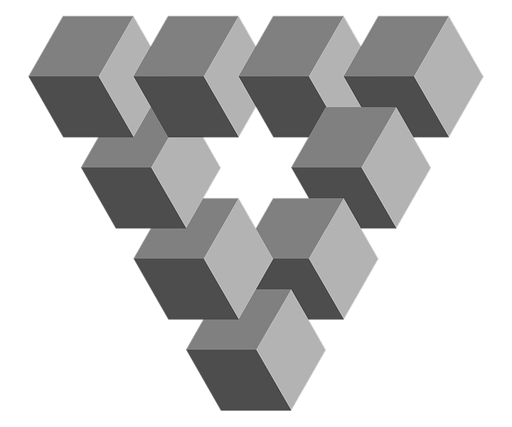
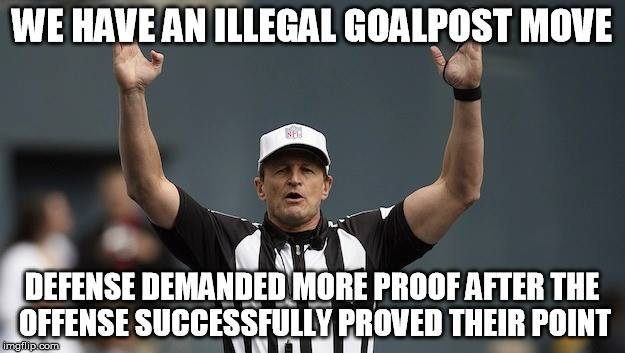

# Fallacies and Biases

:::: {.centerpic data-latex=""}

{width=40%}

::: {.centercap data-latex=""}

[OpenClipart-Vectors](https://pixabay.com/users/openclipart-vectors-30363/) at pixabay.com

:::

::::

::: {.epigraph data-latex=""}
Reality is, you know, the tip of an iceberg of irrationality that we've managed to drag ourselves up onto for a few panting moments before we slip back into the sea of the unreal.\
\
---Terence McKenna
:::

**_Throughout_** our discussions of logic so far, you may all have been wondering how often anyone ever lives up to the standards of logical reasoning as we have laid them out here. It may seem fairly obvious that most people do not seem to be either willing or able to accept only those claims that are conclusions of sound arguments, but instead we often decide based on feelings and instincts or on the basis of what we just want or assume to be true at the outset. In fact, there is a theory of the origins of our capacity for logical reasoning known as the "[argumentative theory of reasoning](https://www.edge.org/conversation/hugo_mercier-the-argumentative-theory)" that claims that our logical abilities, such as they are, evolved to enable us to "prove" ourselves right. Before the abstract study of logic was invented by Aristotle, who sought the universal principles governing reasoning, we were all already adept at persuading others by manipulating logic for the sake of convincing others that we were right and hence asserting social dominance, whether or not our claims were truly justified. It seems, in other words, that the rhetoricians were right after all that logic is just one means of persuasion among others, no better or worse than them, but maybe more or less effective in different contexts. 

**_Or is it?_** As we saw in the last chapter, there is something to be said for being logical. Put simply, valid and sound reasoning really just boils down to not saying more than you really know and this seems like a pretty reasonable approach if we want to figure out what is true and what is not. It is, however, abundantly clear that us humans often fail to abide by this principle and make claims that we really don't have much support for. This chapter explores two related ways we do this -- by committing fallacies and by getting caught by various "cognitive illusions." Fallacies are bad arguments -- they are typically invalid -- that are often used to try to convince someone of some point that really has little argumentative support. They work, to the extent that they do, because they take advantage of certain weaknesses in our reasoning skills. As we will be seeing, a careful analysis of how various different forms of fallacious reasoning work and of what mistakes they make can provide us with a certain degree of protection from those who would use them to convince us of things that have little real support. Cognitive illusions are related in that they lead to mistakes in reasoning, but they are often more difficult to spot and avoid falling prey to, since they are mistakes rooted in mental shortcuts that can be reliable in certain contexts. Like visual illusions, they are false representations of reality, which, even if we know  they are false, we cannot help falling prey to. Looking at some common cognitive illusions can help us to see, however, why we should sometimes not trust our own thought processes as much as we often do. And this as well can provide us with more tools for distinguishing between between what is really the case and what just seems to be so.

**_As we turn to examine_** some important logical fallacies it is helpful to keep in mind that there are both many more particular fallacies than the ones we are going to look at and also many different ways of categorizing them. The thing to keep in mind here is that all stretch logical support beyond its breaking point, and how in particular this happens is not always so clear. On the other hand you can usually see the weakness of an argument that relies on a fallacy by asking yourself a simple question about it: What is being claimed here, and on the basis of what? This often reveals the basic weakness of the argument as it involves stepping back from the particular claims being made in order to see the broader pattern and strategy of reasoning involved. It is this pattern that is flawed, regardless of the content of the argument. As a result, we can often find instances of the same form of fallacious reasoning used with many different topics, especially those that are controversial.

**_In addition_** it can be helpful to look at fallacies in terms of a few more general types of mistakes in reasoning. That is what we will do here as we examine some different forms of bad reasoning under the headings: [fallacies of *relevance*](#relevance) all of which depend on premises not relevant to the conclusion; [fallacies of *ambiguity*](#ambiguity) all of which depend on the ways in which many words and expressions can have multiple and often incompatible meanings; and [fallacies of *presumption*](#presumption)," which depend on unacknowledged, unjustified extra assumptions.

## Fallacies of Relevance {#relevance}

**_As we turn to_** the fallacies of relevance, it is good to remember these fallacies depend on the use of information that may seem relevant to establishing the conclusion but isn't really relevant after all. They often play on our emotional responses to certain situations and topics and they can be quite effective as means of persuading us. They work so well in getting us to buy into their conclusions in part because of the nature of the human mind – even though we are capable of thinking about things coolly and logically, we often jump to conclusions on emotional grounds and then enlist our cognitive abilities merely to rationalize decisions and conclusions we have already made. Philosophers would encourage us to resist such impulses and to stop and think before jumping to conclusions. This can of course be quite challenging just because of the way in which our brains are wired – the neural pathway between sensory input to motor and cognitive output is shorter in its trip through those parts of the brain that process emotions than it is through our higher cognitive powers. But still, whoever said leading an examined life was the easiest thing to do?

### Appeal to authority {-}

::::{.center data-latex=""}
:::{.argument data-latex=""}
My friend who is a scientist insists that global warming is not cause for alarm, and for me that is a good enough reason to accept her conclusion.
:::
::::

**_This fallacy_** is also known as “appeal to inappropriate authority.” Appealing to authority is a commonly used way of trying to convince people. But why do we find authorities believable in the first place? Because they are authorities? In this case we may wonder why they are considered authorities at all. On the other hand if they have something to back up their claims, why don't we just see for ourselves whether they are right or not? 

### Ad hominem {-}


::::{.center data-latex=""}
:::{.argument data-latex=""}

There is no need to take that animal rights activist seriously.\

After all, she also benefits from the use of animals – notice her leather shoes and fur mittens.

:::
::::


**_The name_** of this fallacy is a Latin expression meaning "against the person." It is also known as the "abusive fallacy," or "personal attack." This very popular fallacy focuses on the personal inconsistency of the person giving the argument in an attempt to discredit their argument. People who use this strategy don't respond directly to their opponent's argument but bring up external reasons not to believe anything he or she says. This is clearly wrong since it is the argument that someone gives and its validity and soundness that should be our concern not the person from whose mouth that argument happens to be coming.

### Popular appeal (bandwagon fallacy) {-}

::::{.center data-latex=""}
:::{.argument data-latex=""}

The Romans were justified in slaughtering thousands of slaves.\

After all it was a part of their culture and not many people objected.
:::
::::

**_This fallacy_** involves appealing to what most people or the majority of people think as a way of determining what is really true or really right. But as pre-civil rights segregation laws show – what the majority wants or believes can very easily be wrong. The fallacy known as the "appeal to tradition" is similar in that it claims that tradition, the way people have been doing things for a long time, is a good enough basis for us to believe or act as they did. This, of course overlooks the possibility that they were wrong or had no good reason to believe or act as they did.


### Appeal to force {-}

::::{.center data-latex=""}
:::{.argument data-latex=""}

The reason that we are right is because we have the military might to get rid of any government that disagrees.
:::
::::

**_However effective_** force or threats of force may be in getting people to do what we want, we may wonder whether this approach really is attempting to convince anyone of anything. Even though threats may get people to say that they agree with you, this shows nothing about whether or not the conclusion is true or whether they really believe what you are saying.

### Appeal to consequences {-}

::::{.center data-latex=""}
:::{.argument data-latex=""}

If astronomers are correct, the earth orbits a relatively insignificant star in a remote corner of one galaxy among billions.\

But this conclusion violates our sense of the significance of our own lives and so it must be false.
:::
::::

**_This fallacy_** involves rejecting some particular viewpoint, theory or idea based on the consequences to which it leads. These consequences are often emotionally loaded, the kinds of things that we may not want to believe. However, it is often simply irrelevant whether or not we like or want to believe something: the truth may in fact be indifferent to what is pleasing to us. The way to tell what the truth of the matter is, is to examine the evidence rather than reject a theory out of hand because it has unappealing consequences.

### The naturalistic fallacy {-}

::::{.center data-latex=""}
:::{.argument data-latex=""}

Women alone are capable of having babies.\

So the responsibility of raising and taking care of them is entirely theirs.
:::
::::

**_Next we have_** the naturalistic fallacy. We often appeal to nature as if natural things, practices, etc. were automatically good. This is perhaps understandable in a world filled with various artificial substances of dubious safety. But we should be careful of making such appeals since they involve a leap of logic. The problem with the naturalistic fallacy is actually quite a general problem -- the attempt to conclude something about what should or ought to be be the case from what simply is the case. In this example, the facts of how human reproduction work entail nothing about who should play what role in raising children. That is a matter of social relations that, us philosophers hope, should be based on a free and open (and rational) discussion between those involved and not on the "facts of life."


### The genetic fallacy {-}

::::{.center data-latex=""}
:::{.argument data-latex=""}

Newspapers are businesses that make profits from selling papers.\

So we should distrust what they publish since it is bound to be affected by their desire to make money.
:::
::::

**_Arguing like this_** is a more general version of the naturalistic fallacy. We often assume that where something comes from affects its nature in fundamental ways and so we automatically tend to distrust research that is paid for by corporations, we distrust claims made by people who stand to gain from what these claims are about and so on. Although it may seem like wise advice to "follow the money" and keep in mind that those who pay the bills might use their power to determine the content of the conversation, insisting that *this must be* the case simply does not follow. In the case of the news media, the fact that a large newspaper corporation makes money for its employees doesn't automatically slant what exactly they are saying in one way or another. This is because one part of their business strategy might also be to maintain high standards of independently verified journalistic integrity. If they are selling their repuation as reliable reporters, and there is an independent way f=of determining the truth of their claims, there is not necessarily a conflict built into the idea of selling newspapers. Just as in the case of other fallacies of relevance, such as appeak to authority and ad hominem, in this case waht matters is not so much who is saying something but what is being said, and we can see for ourselves whether or not it is reliable or slanted in any way.


### Red herring {-}

::::{.center data-latex=""}
:::{.argument data-latex=""}

We shouldn't worry that much about people dying of horrible diseases in Africa.\

After all we have problems of our own to deal with.
:::
::::

**_The name_** of this fallacy comes from the British method of fox hunting. First a captive fox is released and then a pack of foxhounds follow its scent trail, followed in turn by the hunters. In order to make it a little more difficult for the hounds to follow the fox, a piece of smoked herring (a smelly fish that typically is red in color) is wiped on the ground across the fox's path and thrown off to the side somewhere. This serves to distract and confuse the hounds and gives the fox a chance to get away. In an argument whenever you bring up something irrelevant in order to draw attention away from the topic at hand you are relying on the fallacy of red herring. The problem with the reasoning in this example, of course, is that there is no mention made of the possibility that both problems in Africa and problems here can be addressed. Besides mentioning something off the topic in no way undermines whatever claims are made about that topic.

### Weak analogy {-}

::::{.center data-latex=""}
:::{.argument data-latex=""}

Galileo was ridiculed because of his views, and these views later proved to be correct.\
I too am ridiculed for believing that the Pope is a reptilian alien in league with the Freemasons.\

Thus I too will have my day and my views will be accepted.
:::
::::

**_Analogies are_** comparisons between different things. We reason analogically when we argue that because one object or concept has a certain feature, other objects or concepts that are similar in certain respects will also have that feature. This is an important way in which we make sense of the world. However, it has its drawbacks. If we are not careful we can end up making analogies when they are not really there. This argument is based on a weak analogy because it is just not the case that all views that are ridiculed end up prevailing in the end. Some do, like Galileo's, but the reason was not inherent in their being ridiculed, but on their being based on good reasoning supported by evidence in the appropriate ways. And by the way, there really are people who believe that the Pope is a reptilian alien, just google it and see.

## Fallacies of Ambiguity {#ambiguity}

**_The next set_** of fallacies relies on the fact that many terms have multiple meanings. Switching between meanings without acknowledging that one is doing so is a way of making invalid reasoning look valid. Closer examination reveals arguments that do this to be weaker than at first glance. Here we will consider just a few examples. Many more often appear in debates and you can find out about many more examples by following the links at [the end of this chapter](#further-3).

### Equivocation {-}

::::{.center data-latex=""}
:::{.argument data-latex=""}

People in jail are really free.\

This is because if you can think whatever you want, then you are free and people jail can certainly think whatever they want.
:::
::::

**_Equivocation_** is using multiple meanings of a word as if they were the same. We start out with one meaning of a word like "freedom" and end up with another meaning, in the attempt to fool the person who is listening to us that our reasoning is valid. Since many words have multiple meanings it is important to watch out for subtle shifts as an argument progresses.

### Straw person {-}

::::{.center data-latex=""}
:::{.argument data-latex=""}

The senator who suggested cutting funding for the new Air Force attack drone system really wants to leave us defenseless against our enemies.\

Thus we should reject such cuts.
:::
::::

**_This fallacy_** often appears in the context of a debate in which one person misrepresents his or her opponent's view in order more easily to knock it down, like a person made of straw. This is a fallacy of ambiguity in that it relies on a superficially similar version of the view that is being attacked rather than the view itself. One can often "win" debates by using this strategy, but such victories are hollow in that they do not really engage with the real issues. If you really want to demonstrate that some view you are attacking is worthy of rejection, it is far better to rely on the "principle of charity" and present your opponent's view in as favorable a light as possible. If it still fails, then your position may look even better. The drawback, however, is that if you represent your opponent's views in a more fair and favorable light, your objections to them may themselves not hold up. But that is really only a drawback if you care more about winning debates rather than in figuring things out.

### Cherry picking {-}

::::{.center data-latex=""}
:::{.argument data-latex=""}

This study of 12 children clearly shows a link between childhood vaccination and autism.\

Thus vaccines cause autism.
:::
::::

**_This one_** is really no joke -- in fact the whole of the current scare about childhood vaccinations and autism was "established" by a single study of twelve children! The fact that the paper was retracted, and its author was barred from medical practice didn't matter since its influence only grew since the date of its publication. The logical mistake here is that of selectively reading the evidence in favor of your own hypothesis, or "cherry picking" the data to get the juiciest bits while ignoring anything that contradicts it. The other name for this fallacy, "Texas sharpshooter" refers to the related practice of proving your worth as a target shooter by first shooting random holes in the side of a barn, and then afterwards drawing your target around a cluster of holes so that it looks like you are a great shot. Is this done in Texas? Probably not, but whoever named it must have had a low opinion of Texans -- no offense intended and if you are from Texas, substitute your state of choice.

## Fallacies of Presumption {#presumption}

**_The third set_** of fallacies we will consider here are those that make presumptions, often in a hidden way. That is, they rely on hidden and unstated assumptions written, as it were, between the lines. This strategy, however, cannot withstand critical analysis since if we can get the perpetrator of such fallacies to acknowledge these hidden presumptions we can see them for what they are, mere assumptions without warrant.

### Mere assertion {-}

::::{.center data-latex=""}
:::{.argument data-latex=""}

Abortion is just wrong, and that is all there is to it.
:::
::::

**_This is_** the simplest and most obvious kind of bad reasoning. As the name implies, mere assertion involves simply stating what you want to establish without presenting any evidence whatsoever to support it. It is truly amazing how often people simply assert something that they may think is true without bothering to offer anything to support this assertion.

### Begging the question{-}

::::{.center data-latex=""}
:::{.argument data-latex=""}

You should become a Christian.\
This is because the Bible says that if you are not a Christian you will go to Hell.
:::
::::

**_This strange sounding_** name really applies to a very simple technique. Someone who begs the question is guilty of assuming what they are claiming to establish in their argument. In other words they put a disguised version of their conclusion in the premises of their argument. That is, they are not really arguing for what they claim to be arguing for. This is an example of a fallacy that is nevertheless a valid form of reasoning. The problem here is that we cannot just assume that the conclusion is true, as someone who uses this way of argument is in fact doing. Begging the question is not, of course, always so obvious. We can see that this is a case of begging the question when we realize that the only people who will be convinced by this argument are Christians. Why? Simply because nobody else will take evidence from the Bible seriously, and people who consider the Bible as authoritative are already Christians. This example also shows why begging the question is also known as "preaching to those already converted."

### Appeal to ignorance {-}

::::{.center data-latex=""}
:::{.argument data-latex=""}

The claim that the death penalty deters crime has not been established with any certainty.\
Thus it is clear that it does not deter crime.
:::
::::

**_The fact that_** something has not yet been proven to be true does not mean that it is false. It is just unknown! Yet this fallacy assumes that if we do not have proof of something then that thing must be false.

### False dilemma (black or white fallacy) {-}

::::{.center data-latex=""}
:::{.argument data-latex=""}

Either living organisms are products of blind chance or they were deliberately designed.\
But it makes no sense that something as functionally complex as a living organism is the result of blind chance.\

Hence they must have been designed.
:::
::::

**_The argument here_** rests entirely on an assumption that is not always so easy to see, the assumption that the alternatives stated are the only ones there are. If this were the case, then the argument would stand, but often other alternatives are simply not even mentioned. Hence the dilemma, or forced choice between two alternatives, is here a false one. In the example below, which is often used against the theory of biological evolution, the missing alternative is precisely what Darwin articulated in his book *On the Origin of Species*, a theory which contains an element of chance but which is not reducible to the blind chance that this argument presumes is the only alternative to deliberate design.

### Hasty generalization {-}

::::{.center data-latex=""}
:::{.argument data-latex=""}

All three of my ex-wives always told me what to do.\

This clearly shows that all women want to control us men all the time.
:::
::::

**_We may be tempted_** to conclude a lot from a single case, or a relatively small sample, but this is often merely a way to confirm our prejudices. If we really want to make sweeping generalizations, we'll have to gather a bit more evidence in less clearly biased ways than this.

### Slippery slope {-}

::::{.center data-latex=""}
:::{.argument data-latex=""}

If we legalize physician assisted suicide then everyone over sixty had better watch their backs.\

Once doctors get used to helping people with terminal illnesses die comfortably, they'll find it easier to get rid of older people.
:::
::::

**_Slippery slope arguments_** are often used as a way of warning us of the dangers of allowing people to do something that is now forbidden. They say, in effect, if we allow someone to do this, then they'll have no reason not to do that, which is much worse. The name comes from the metaphor of an icy ski slope: if we are foolish enough to step onto the slope, without skis on of course, we'll end up uncontrollably sliding down to the bottom. The problem with this argument is that it claims that we must end up where the arguer claims we will, but the argument gives does nothing but assert that.

### False cause {-}

::::{.center data-latex=""}
:::{.argument data-latex=""}

The majority of heroin users smoked marijuana when they were younger.\
So smoking marijuana must be one of the causes of heroin use.
:::
::::

**_Us humans_** are very good at noticing patterns in the world around us. In fact science is based on this ability – we notice regularities and then come up with explanations for them. The most powerful of these explanations involve attributing a causal relationship between events that appear to be related to each other in a regular way. We have to be careful here, however, since we also have the tendency to overdo this. This may seem like a convincing argument until we recognize that the fact that something tends to happen before something else is not nearly enough to establish that the first thing causes the second to happen. For example, the fact that my alarm clock goes off every day shortly before sunrise does not mean that my alarm clock causes the sun to rise. The same goes for drug abuse. The fact that I abused marijuana first and then heroin later does not mean that the first caused the second. It is equally possible that I abuse whatever drugs I abuse for another reason -- I have major problems I am trying to escape from.

### Circular reasoning {-}

::::{.center data-latex=""}
:::{.argument data-latex=""}

He must be guilty, since he has a guilty look on his face.\

Furthermore, the look on his face indicates guilt, because he is the one who did it.
:::
::::

**_This final fallacy_** in our list is, in a sense, a more complex version of begging the question. Circular reasoning involves bouncing back and forth between two assumptions each of which is supposed to be the basis for the other. To see the circular structure of the reasoning exhibited here it may help to figure out which statement is the premise and which is the conclusion. In this example, at first glance it seems like the conclusion is "He is guilty," and this seems to be based on the premise that "He has a guilty look on his face." However, the fact that the look on his face indicates guilt is then supported by the assertion that "He did it." Clearly we are moving around in a circle -- our premise supports and is supported by our conclusion. There is thus no real support for either and the whole structure is unfounded. This fallacy is also known as the "vicious circle" fallacy.

## Cognitive Biases

**_Fallacies_**, as we have been seeing, are common mistakes that we make in reasoning especially when we are trying to support a conclusion that we have insufficient evidence to support, ways in which we claim more than we really know. In recent years cognitive psychologists have also explored the ways in which not only get our arguments wrong, but also tend to get things wrong in our own thinking, how as Thomas Gilovich puts it in the title of his book *How We Know What Isn't So*.^[@gilovichHowWeKnow1991] That is, we have a tendency to fall prey to biases and mistakes in our own reasoning whatever it is that we may end up defending later in our arguments. In this section we'll look at some of the most important and relevant of these cognitive biases.

**_In general_** we might classify these biases into two general types: "hot biases," or motivated irrationality where our interests, emotional responses or visceral reactions to things influences our thinking process; and "cold biases" or unmotivated irrationality which are a result of certain mental shortcuts and routines we rely on even in situations where they do not really apply. Let's look at some examples.

### **Hot Biases**{-}

**_Hot biases_** are also known as examples of "motivated irrationality" because they involve bending our reasoning to suit our wants and desires. Our motivations may not always be clear even to us, so we may not realize that we are caught up in such biases. Luckily, however, there are steps we can take to avoid falling prey to them.

### Confirmation bias{-}

**_Confirmation bias_** is our often unconscious tendency to give more weight to evidence supporting our pre-existing beliefs or hypotheses and our tendency to downplay the significance of evidence against them. The result is similar to cherry picking but it may not be a deliberate attempt to mislead, but more of a product of other unconscious tendencies.

::::{.center data-latex=""}
:::{.argument data-latex=""}

I keep seeing more and more evidence in favor of my hypothesis! What about the evidence against it? Well that must be based on faulty data collection.
:::
::::

Given that we have a strong tendency to fall prey to this bias, what steps might we take to avoid it? For one, we can use various "blind" methods of data collection and analysis to protect our reasoning from the errors involving confirmation bias. "Double blind" medical trials follow these precautions -- to avoid confirmation bias, the patients involved in the trial of a new drug, for example, don't know whether they are getting the drug or a pacebo, and the researchers also don't know whether each particular patient they examine afterwards are in the test group who receive dthe drug of the control group that didn't

### Group think{-}

**_Just like_** our pre-existing beliefs can influence what we take the evidence to support, likewise with our connections to other people can do so. When someone in a group we identify with comes up with an idea we have tendency to give it more weight than in fact it deserves. A great example of this occurred during the Kennedy administration with the Bay of Pigs incident. The plan was to send a small group of armed anti-Castro Cuban soldiers to the Bay of Pigs in Cuba with the thought that that would be enough to incite a full-scale revolt against the Communist government by the rest of the Cuban population. Enough members of Kennedy's National Security Council which planned and approved the incursion were strongly in favor of it that they collectively ignored their own military intelligence which indicated that there was little popular support for revolting against the Cuban government. So when the invasion happened in January 1961 the initiative was quickly defeated and the Cuban exiles who landed in the beach were quickly arrested and imprisoned much to the embarrassment of the Kennedy Administration.^[@BayPigsGroupthink]


### Wishful thinking{-}

**_These last two_** biases could be considered specific examples of a more general tendency we have towards wishful thinking, which is the tendency to project our own desires onto reality and fool ourselves into thinking that reality conforms to how we would like it to be.

::::{.center data-latex=""}
:::{.argument data-latex=""}

I just know that the Yankees will win the World Series, they just can't let me down again!
:::
::::

All of these biases fail to make a distinction between what we would like to be the case and what really is in fact the case. We may end up lucky and happen to find out that reality conforms to how we would like it to be, but then again we may not. We can protect ourselves against these kinds of biases first by being aware of our own tendencies to fall prey to them and then by using particular strategies to separate our analysis of the evidence from our wishes.


### **Cold biases**{-}

**_Cold biases_** differ from hot biases in that they are not such much results of our desires but of the ways in which our cognitive systems work. They are more like "bugs" in our mental operating systems than ways in which we twist our thoughts to conform to our desires.

### Anchoring/framing effects{-}

**How much** are you willing to pay for some given product or service? Well it turns out to depend not just on the features of that product or service itself but also by what is next to it on the shelf, what other options you are presented with and even the initial asking price. These are examples of the ways in which the context of our choices influences the content of our choices. Many examples of this can be found in the marketplace. The notorious "bait and switch" tactic relies on this bias.

::::{.center data-latex=""}
:::{.argument data-latex=""}

Today only, you can get a new Toyota for 20% off the sticker price! So act now and drive your new car away today!
:::
::::

There are numerous ways in which advertisers and salespeople try to influence our choices. First the "sticker price" may or may not reflect anything about the reality of the product in question but may be intentionally inflated to anchor our minds to a price higher than we would actually pay. It turns out that doing so will make us more willing to pay a higher price than we would if the original non-discounted price were set closer to what we might actually pay, or what the manufacturer expects us to pay. Likewise, adding extra options that we may not actually be interested in independently can influence our willingness to buy a product, especially when it is compared to an otherwise equivalent product without those potions. In both cases our ability to compare what is offered with what we want is corrupted by the context within which the product is presented.^[For more on anchoring effects see [@kahnemanThinkingFastSlow2011]]

### The fundamental attribution error {-}

**_When it comes to_** explaining human behavior, and trying to figure out the relative weights of internal factors such as needs, desires and the personality of the actor on the one hand, and external situational factors on the other hand it turns out that we come up with different weights when thinking about our own behavior and that of other people. our own and others. We tend, for example, to put more weight on things outside of our own control when accounting for our bad behavior than we do when accounting for the behavior of others.

::::{.center data-latex=""}
:::{.argument data-latex=""}
The fact that I tripped when walking down the street was because the sidewalk was uneven. When you trip on the other hand, it's evidence that you are a klutz.
:::
::::

**_In other words_** we are more generous with ourselves in terms of getting ourselves off the hook — it's not my fault it's the situation I was in — than we are with others — clearly it is their fault! This is true that in many, many cases, if we looked at things in the more neutral terms of finding what factor most influence all of our behavior situational or external factors often play a much greater role than we think. So we are more accurate when we reflect on ourselves than when we look at the behavior of other people. Our attribution of causal influences tends to be skewed in the wrong direction when we look at why others do what they do especially when we compare it with our understanding of what influences us ourselves.

### The availability heuristic {-}

**_Finally_** in this brief survey of some major cognitive biases we have the confusion we tend to make between how readily something comes to mind (its "salience") and the more objective probability of its occurrence (its "frequency"). Thus because terrorist attacks are so dramatic and stand out in our minds much more than the more common and mundane threats we are exposed to we tend to be more afraid of terrorism than, for example, driving to the airport. In the aftermath of the 9/11 attacks I remember listening to an interview with an expert on national security threats. The interviewer asked him what we could all do to be safer in international air travel and his response was "Drive very carefully to the airport." This effect, once you start to notice it, is everywhere. We focus on dramatic if also highly unlikely threats and events and ignore those that are far more likely and hence, paradoxically, not so obvious to us.

**_In this_** and the last chapter we have taken a closer look at what is involved in the justification of any claim at all. We have seen that the best arguments are both valid and sound – they work logically in that their premises really provide adequate support for their conclusions and their premises are actually true. We have also examined some of the many mistakes in reasoning to which we are prone. These mistakes are not only used in a deliberately misleading way, since all of us have a tendency to make decisions and judgments first and then come up with reasons in support of them later. Thus we often rely on fallacious reasoning to rationalize our own beliefs or we tend to read the evidence is biased ways. As we will be seeing, as we turn now to start examining some of the many different theoretical approaches to ethics, the tools of logic and critical thinking will prove very useful in trying to come up with a reasonable answer to the general question, "what is the right thing to do?"

## Further exploration {- #further-3}

- Here is a [summary in slideshow form](https://gwmatthews.github.io/ethics-slideshows/03-fallacies.html) of the content of this chapter.

**_There are many_** great websites that list, discuss and explain the many ways we get things wrong in our thinking. Here are a few of my favorites.

- [*Your Fallacy Is*](https://yourlogicalfallacyis.com/) is a nicely designed website with more examples of common fallacies.

- [*Your Bias Is*](https://yourbias.is/) is the sister site to Your Fallacy Is and focuses on common cognitive biases. 
   
- [*Logically Fallacious*](https://www.logicallyfallacious.com/tools/lp/Bo/LogicalFallacies) is a site with a huge and comprehensive list of logical fallacies and cognitive biases. A great reference with lots of examples.
   
- Dan Ariely is a behavioral economist who studies human irrationality and has written a number of very readable books documenting his findings. He also has a number of videos of talks he has given on his site, [danariely.com](http://danariely.com/)
  - http://danariely.com/
   
- And you should of course follow the [Logical Fallacy Ref](https://twitter.com/fallacy_ref) on Twitter.
  
:::: {.centerpic data-latex=""}
{width=50%}

::::
   
   
```{asis, echo=identical(knitr:::pandoc_to(), 'html')}
<br>
  <br>
  <hr>

**Editorial comments**

If you have a GitHub account and want to make any editorial suggestions, please do so here.

<script src="https://utteranc.es/client.js"
        repo="gwmatthews/ethics"
        issue-term="title"
        theme="github-light"
        crossorigin="anonymous"
        async>
</script>

```
