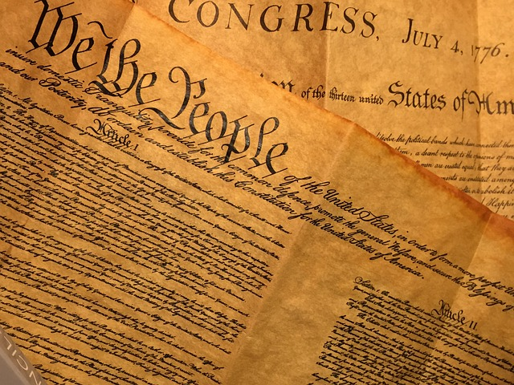

# Social Contract Theory

:::: {.centerpic data-latex=""}

{width="50%" alt="illustration"}

::: {.centercap data-latex=""}


[lyn0101](https://pixabay.com/users/lynn0101-8308820/){target="_blank"} at Pixabay.com

:::

::::

:::{.epigraph data-latex=""}
For it can never be that war shall preserve life, and peace destroy it.\
\
---Thomas Hobbes, Leviathan
:::

**_At this point we have considered_** five different approaches to understanding and explaining ethics -- Relativism, Divine Command Theory, Natural Law Theory, Psychological and Ethical Egoism. Each of these at first might have seemed to offer a reasonable account of the origins and nature of moral principles, or in the case of egoism of why moral principles are best ignored. But then each also turned out not to hold up very well to critical analysis. Let's briefly look back at what went wrong in each case, since maybe that might help us find a way to move forward in our quest to find a basis for morality and ethics.

**_Relativism claimed_** that morality is nothing but a set of culturally dictated rules and that as a result of this, that there are no moral universals. Even if relativism may seem obvious to some people, in the end, it seems to overstate its case. Is there really no such thing as something that is just plain wrong? And does relativism really succeed in establishing that there really are no universal rules underlying particular cultural norms. If there are deeper common rules that transcend cultures, the relativistic claim that particular cultural rules are binding on us because there are no others would lose its force. And finally, relativism fails to provide a convincing answer to the question "Why should I listen to what my culture tells me I should or shouldn't do?"

**_Divine Command Theory,_** on the other hand, appealed directly to an authority that supposedly commands universal assent, God, as the basis for moral rules. But this theory ran into trouble as well, since it rested everything on an appeal to authority. The problem here is that simple appeals to authority fail to provide any reasons why we should follow the commands of even an absolute moral authority -- "Is it because God commands me that I should follow the rules, or should I follow these rules because they are really the correct rules?" Neither of these options really provide reasons to accept a set of rules -- the first says follow the rules or else, and the second says that there are reasons to follow the rules but fails to provide them. So we are left not really having any idea why we should bother following the rules.

**_Next, natural Law Theory claimed_** that we should orient our lives according to what nature dictates by striving to fulfill our natural capacities and by avoiding anything "unnatural" that violates the natural functions built-in to our bodies and minds. Once again, however, this theory failed to provide a convincing reason for us to follow human nature. Even if we could all agree about what our natural capacities and functions really were, we can always still ask, "But why should I do what my nature tells me I should do?" Unlike other animals who have no choice but to follow their natures it is always an issue with us humans whether we should do what our instincts tell us to do or not.

**_Psychological Egoism_** in contrast to these last theories, dismissed ethical rules are unrealistic. But it turned out to have little explanatory power and amounted to nothing but a cynical dismissal of ethics. Thus once again the question of why strive to be a good person reasserts itself.

**_Finally Ethical Egoism_** attempted to show how ignoring ethical demands was in fact the best way to achieve the social good. This position, it turns out was not well defended, nor in the end did it even seem logically coherent. Here too we are left with an unanswered question -- if focusing on oneself is the best way to achieve the best outcome for all of us why should we even care about this outcome in the first place?

**_I hope a pattern_** is becoming apparent here. Each of these theories tried to solve the problem of explaining and/or justifying moral principles with its claim to have found the source of the basic moral rules that govern our lives together in society (or in the case of egoism why such rules are beside the point). In spite of the differences between these sources of moral rules, however, all of these theories leave something out. They all fail to spell out why it is that we should listen to any rules in the first place. All assume that the job of ethical theory is simply to find the source of ethical rules and that once we have found it we are done. Now it might strike you that this is an unfair criticism of these theories since each of them does at least suggest a reason why we should comply with the rules. Why should we take culturally dictated rules seriously, or why we should listen to the commands of God or human nature, or build a society based on the powers of "invisible hand" of market driven competition? If we don't we will fail to fit in with those around us, or we will end up being punished by God, or we will fail to find the true fulfillment that Natural Law Theory claims we can only get by following our true natures, or we will act in a way that is counterproductive to a good social outcome.

**_This is not enough, however,_** since wherever the demands to conform to any rules come from it is always possible just to ignore them. I can simply ignore my culture, God, human nature, and even the demands of me, myself and I if I want to. The rules of human conduct are not like the laws of nature, since they depend in a crucial way on *choice.* Even rules that supposedly come from outside of us still depend for their existence as rules on something inside of us, our freely granted consent to follow them. And if this is true, it seems less important to figure out where the rules of society and morality come from than it is to address the question of what it is about those rules that would encourage us to comply with them in the first place. After all, rules that nobody felt any reason to comply with would automatically cease to be rules, as anyone who has had first hand experience of a child in her "terrible twos" knows all too well. A stubborn two year old who has just learned the power of the word "no" doesn't have to do anything at all, no matter who says so. Likewise with ethical rules, we can and should all ask, "Why should I follow the rules in the first place?"

**_Social Contract Theory_**, as our next approach to ethics is called, is an attempt to answer the question of why we should follow the rules of the social game when we have a choice not to. In contrast to all of the other theories we have looked at, it doesn't just assume that saying where these rules come from is enough to get them to stick. Instead it tries to explicitly ground the rules governing our social lives in our ability to make free choices.

## Hobbes and the Invention of Society

:::{.epigraph data-latex=""}
To this war of every man against every man, this also in consequent; that nothing can be unjust. The notions of right and wrong, justice and injustice have there no place. Where there is no common power, there is no law, where no law, no injustice.\
\
--- Thomas Hobbes, Leviathan

:::


### Ethics in times of social and political change {-}

**_Historically speaking_** the question of why and which rules to follow come to the forefront in times of great social and political change. Political revolutions, for example, take place when an old order breaks down and this happens when enough people no longer feel compelled to follow the rules of the old authorities, when the old authorities no longer seem legitimate. Thomas Hobbes (1588-1679) was one of the first philosophers to recognize this fact about social rules in part because he lived through a time of great social upheaval, the English Civil War of the 1640's. Traditionally English kings had commanded absolute authority and had even claimed that this authority was granted to them by God. But these claims made no difference if enough people were willing to go against the authority of the king by simply refusing to follow orders issued by the king and his agents. Hobbes' experiences of the complete social breakdown of the Civil War period and the eventual restoration of the deposed monarchy convinced Hobbes that all rules of society and morality were inherently conventional, or products of the choices of the members of any society.

**_The problem for ethical theory_** for Hobbes thus shifts from that of answering the question "what are the rules governing behavior?" to that of answering the prior question "why should we follow any rules at all?" Hobbes also thinks that answering the second of these questions will give us important clues as to how to answer the first. If we can figure out what it is that encourages us to conform to social rules, we can also start to see what rules it is that we are mostly likely to accept as valid rules. This is the basic idea behind Social Contract Theory.

### The state of nature {-}

**_In order to answer_** the questions of why we should follow any rules at all and what those rules might be Hobbes asks us to engage in a mental exercise, a "thought experiment."^[Note that I am here intentionally ignoring the difference between ethical rules that would regulate individual conduct and the rules that make up the social order -- the rule of law. Social contract theory historically was an attempt to legitimize political authority, or why governmental institutions and rules should be respected. However, it seems to me that the arguments given here apply more generally to any sort of rules of social interaction like ethical rules as well. Contemporary backers of SCT, such as David Gauthier tend to look at it as operating on this more general level as a theory of any sort of socially binding norms.] Suppose, he asks, that there were no rules, that we lived in what he calls a pre-social "state of nature," in which all of us are free to pursue our own interests with no religious, legal, moral or other restrictions on our behavior. In such a situation would we have any reason to create and honor any rules limiting our freedom? Would we have any reason to respect other peoples' property, to keep our promises to them, to cooperate with each other at all? Well, if there were no binding rules limiting acceptable behavior, Hobbes answers, we would have no interest in cooperating with each other. If there were no rules limiting our treatment of each other we would do whatever we thought we could get away with in pursuit of our own interests. Furthermore, in such a state of nature, since we would lack the ability to work with each other to produce the things that we all need to have comfortable lives, we would all be faced with chronic shortages of the necessities for life. This would lead ultimately to a "warre of all against all," in which those who thought they were stronger, smarter or more cunning would try to take advantage of others perceived to be weaker in one way or another. In the end, however, all of us would suffer and life in the state of nature, to cite Hobbes' famous description would be "solitarie, poore, nastie, brutish and short."

**_So life without any social rules_** would clearly be a mess. Hobbes thinks that this follows from a thoroughly realistic picture of what human beings are like once we strip away all of the conventions of social life. It is not that we are all mean-spirited or intent on hurting others out of maliciousness. It is just that we all need to look after number one first, and without any universally accepted laws of social behavior, it is always better to be safe than sorry and aggressively pursue what is in our own best interests and this for the simple reason that nobody else can be trusted to care about our interests. Once we realize that this kind of individualistic pursuit of self-interest is leading us all down the path to chaos, however, Hobbes thinks it becomes equally obvious that we need to find a way out of this mess. Our lives literally depend on successfully departing from the state of nature and creating rules that will enable us to live with more security than we can possibly provide for ourselves in the state of nature. And this is, according to Social Contract Theory how we can account for the origins of morality among members of a species like us who are naturally interested in only pursuing their own interests. Thus, as Hobbes argues, if there were no ethical or moral rules governing our relations to others, we would still have a very powerful reason to create and follow such rules because, namely, life without them would be unbearable.

**_I have already mentioned_** that Social Contract Theory claims not only that we should answer the question of why we should bother accepting any rules at all, but that by so doing we will be able to also answer the more substantial question of which particular rules are really the rules we should accept. Social Contract Theory not only offers us an account of what it is about moral rules in general that makes them acceptable, it also spells out what those rules would look like.

## The social contract

**_For Hobbes,_** as for other advocates of Social Contract Theory, the big problem of a life without binding moral rules is that cooperation between individuals is impossible. If I have no reason to keep my promises to you, then, should I be tempted to not deliver what I have promised to deliver, I won't bother. If I have no reason not to respect your property when I am in a position to take it for myself, I will just take it. If there is no reason why I should avoid endangering your well-being, when it is to my advantage to do so, I won't pay any attention to whether or not my actions hurt or even kill you. Since, however, it is just these failings that would make life in a state of nature unbearable to all of us, it seems like these are the kind of things we'd all be willing to create rules against. Since not keeping promises, stealing and recklessly endangering others are what we'd most like to escape from in a state of nature, then these are the kinds of things that our moral rules should forbid. Entering into a social contract is then just agreeing to abide by a certain set of rules that we can all accept such as agreeing to keep our promises, to tell the truth to each other, not to steal from each other, or endanger each others' lives for no good reason. These are all of the things each of us wants, so these are the kinds of rules we would all accept. And we should all be willing to give up our freedom to violate these rules, because otherwise life would be unbearable for us all. This suggests an argument for Social Contract Theory.

::::{.center data-latex=""}
:::{.argument data-latex=""}

Life would be unbearable without moral rules.\
So we have a strong interest in developing and following a set of moral rules.\
\
Hence moral rules are a product of human choices and are grounded in our common self-interest in creating and preserving social order.

:::
::::

**_Social rules,_** according this argument, are thus thoroughly conventional rules that are based on mutual self-interest. They are not based on human nature, God's commands or the dictates of some cultural tradition or other. Instead they are put in place in order to allow us to live together, to engage in cooperative tasks, to own property, and to be assured that others will not infringe on our basic needs. The rules, once enacted, create legally enforceable rights and duties and enable us to depart from the chaos of the state of nature once and for all. Or so it seems at least.

## Why *should* we follow the rules?

**_Social contract theory_** is not free from difficulties. Of the two major problems facing it, the first is a lack of clarity concerning the status of the agreement that creates moral rules. Is this supposed to have been a real agreement between real people at some point in the past, or a hypothetical agreement about what people would agree to if they were faced with the task of creating moral rules from scratch. The second problem with has to do with its adequacy as a justification for moral rules in general. Granted that it shows we have a need for such rules, it fails to provide an adequate account of why we should bother to follow the rules when we have constant incentives to cheat.

### What agreement? {-}

**_This first problem_** facing Social Contract Theory has to do with its claim that the authority of the rules of the social game can only be based on the free and willing consent of those under the authority of these rules. If social rules are conventional rules, they can only be binding to those who have freely accepted the restrictions they impose on us. But most of us, who never lived in any situation remotely resembling Hobbes' state of nature, probably cannot remember ever being asked to endorse a social contract. Instead, we are born into a society with a set of rules already established and taken for granted as legitimate rules and we are asked simply to accept these rules. But then how could these rules really be binding on us if we were never asked whether or not they fit in with our ideas of what would serve our interests best? There are two standard ways of responding to this question.

**_First we might say_** that although the social contract was in fact a real historical event establishing a set of conventional moral rules, once these rules have been set in place, they are no longer subject to debate or rejection. Our ancestors who lived in a state of nature were in a unique position to found a social order and, short of the kind of complete social breakdown that occurs during a civil war or political revolution, subsequent generations have no choice but to accept the rules authorized by the original parties to the social contract. Perhaps subsequent generations can tweak particular details of the rules of the social game, as has definitely happened, for example, concerning relations between men and women in the western world. But the basic rules that result in the creation of the social world in the first place must henceforth be taken as given.

**_This response is,_** however, unsatisfactory and even threatens to undermine the very thing that seems unique about Social Contract Theory, its claim that social rules are inherently conventional and based on the free choices of those to whom they apply. That is, if only the original parties to the social contract are in a position to accept or reject some set of social rules, then these rules can count as conventional only for them and not for anyone born into a later generation. But this means that the social rules are just as arbitrary for later generations as they would be if given by a particular culture, by God, or by some conception of human nature.

**_The second way_** to answer the question of why moral rules might be binding on us even if we have never explicitly approved of them starts by rejecting the idea that the social contract should be understood as a real historical event. Instead, the contract should be understood as a hypothetical contract reflecting what rules would be acceptable to free and rational agents if they were living in a pre-social state of nature. That is, the Social Contract Theory is to be recast as an idealized set of rules that any free and rational individuals would be logically compelled to accept in order to avoid the general types of problems that would plague their lives in the absence of such rules. Just like physicists idealize in their accounts of the laws of motion by talking about things like frictionless planes and perfectly elastic collisions, us philosophers are licensed to talk about the requirements of free and rational agents in general, regardless of the historical details of their lives since what we are after is an account of the sorts of rules we should accept. This approach is by and large the approach taken by the majority of contemporary philosophers who take Social Contract Theory seriously as a way of justifying social rules philosophically, and it does seem like a reasonable way to proceed.

**_Thus let us accept_** that Social Contract Theory is not dependent on the claim that a real agreement is at the basis of currently existing social rules. Instead let us accept for the sake of argument that the social contract is a hypothetical device that enables us to talk about what rules would be acceptable to free and rational agents whoever they happen to be. We can now ask a more difficult question of this theory -- why would free and rational agents accept any rules at all that limit their options in the way moral rules do? Moral rules, we recall, should be understood as rules that might get in the way of self-interest. For example, if there is a moral rule against lying to others, this means that whether it suits us at the moment to lie is not important because the rule against lying should overrule our immediate interests. We have seen that Social Contract Theory is based on the idea that we can all agree that certain sorts of behavior should be restricted since they tend to lead to chaos if enough people engage in them. Thus it certainly seems like moral rules have an important role to play in our social lives.

### The prisoners dilemma {-}

**_We may wonder, however,_** whether Social Contract Theory goes far enough by pointing out how moral rules can serve our collective interests. What is to prevent us from accepting a set of rules as long as it does not get in the way of our individual interests but then ignoring the rules whenever it seems to us that it pays to do so? If moral rules are necessitated by the fact that we are essentially self-interested individuals but also need not appeal to anything besides self-interest, doesn't this make moral rules highly unstable?

**_To see why_** this is the case, let us consider a famous puzzle often called called "The Prisoner's Dilemma." This puzzle condenses into a very clear picture the fundamental problem of morality -- why should we trust each other when we are all constantly facing temptations to violate trust and why should we stick to the agreements we make when a situation presents itself where it is in our interest to violate them?

**_Imagine that you and a partner_** in crime have just been arrested after a botched attempt to rob a convenience store. The police have reason to suspect that you two have also successfully robbed other stores in the area but lack sufficient evidence to convict you of these other robberies. Since the police chief has been taking a philosophy course he decides to present each of you the following offer in separate interrogation rooms:

> We have reason to believe that you and your partner have been involved in a string of robberies around here and we would like to put at least one of you in jail for a long time. So if you cooperate with us by testifying against your partner, we are willing to make you a deal. If you testify against your partner and she stays quiet, you will go free and she will get a 10 year jail sentence. If both of you testify against each other then we will give you each 5 years in jail. On the other hand if both of you refuse to cooperate with us and keep your mouths shut, we can only hold you for 1 year for the attempted robbery yesterday. What is your decision?

**_Now suppose_** that you and your partner have already come to an agreement not to rat on each other in case the police try to convince you to do so with an offer like this. What should you do here? That is, what is the smartest thing to do in this case assuming that neither you nor your partner really wants to go to jail and will always opt for a shorter sentence? Is there even a rational solution to this puzzle? Is it better for you or your partner to stick to the agreement not to rat, or is it better to rat? (Note that there are no hidden negative payoffs here, such as, for example, the threat that your partner will take revenge on you later on if you rat since that would distort the puzzle the police have presented to you. Besides, we are assuming that if you testify against your partner, the police will reward you with a new identity through their witness protection program.)

**_The problem here,_** is that you cannot be sure about what your partner will do, since she is being held in a separate interrogation room. All you have is her word that she will not rat on you, and all she has is your word that you will not rat on her. The way to find a solution to this puzzle is to recognize that there are really two possibilities for each of you and thus four possible combinations. Either you partner will keep quiet or your partner will rat on you, and likewise for you. We can arrange these possibilities in a "payoff matrix" like so:


|                |         I keep quiet           |               I rat            |
|:--------------:|:------------------------------:|:------------------------------:|
| you keep quiet |          1 year each           | I go free, <br>you get 5 years |
|     you rat    | I get 5 years, <br>you go free |         3 years each           |


**_So if your partner keeps quiet,_** is it better for you to rat or to keep quiet? Well since you would get less time in jail if you ratted (no jail time versus 1 year for sticking to the agreement not to rat) than if you kept quiet, if your partner keeps quiet then you should rat. But what if your partner rats -- after all, you do not know what she will do -- which is better, ratting or keeping quiet? Well here again ratting gets you less time in jail since if you keep quiet while she rats you end up with 10 years in jail, while if you both rat, you'll only end up with 5 years behind bars. This is known in the jargon of "game theory" which studies strategic situations like this, as a dominant strategy, since no matter what your partner does it is always better for you to rat. Unfortunately, since your partner is thinking in exactly the same way as you are thinking, if both of you choose what clearly seems to be the best thing to do, you will both rat on each other and will end up with 5 years in jail each. Why couldn't you have just kept your mouths shut and gotten only one year in jail each? It would be nice if you could just trust your partner not to violate the agreement you have made, and this seems like it gets both of you the better deal. It's too bad that trust seems to be irrational here since it is always better to rat no matter what the other person does.

**_Much has been written_** about the prisoner's dilemma as a model for certain kinds of basic social interactions. For our purposes here, I'd like to mention only two points. First, this kind of situation arises quite often in the real world, namely whenever we may make an agreement with each other to play by the rules but are constantly tempted to cheat for an immediate gain, in spite of the fact that cheating leads to an outcome that is worse if enough people do it.

**_Think, for example,_** about the problem of over-fishing. All fishermen recognize that over-fishing depletes fish stocks and thus threatens their long term livelihood. So suppose the fishermen all get together and agree that it is in their best long term collective interests to limit their own catch. The question for each fisherman, as he sets out his nets, "Should I stick to the agreement and not over-fish?" He reasons like so: Well, I have no idea if the other fishermen will stick to our agreement. Suppose they do -- in that case my over-fishing won't hurt anyone else's long term livelihoods, but I will benefit by having more fish to sell. On the other hand, supposed they also over-fish -- in that case I would be a fool not to also over-fish since my short term benefits would be better if I did and there won't be any fishing for anyone after a few years of over-fishing, so my not over-fishing does nothing to protect my long term interests. So everyone, reasoning in a similar fashion over-fishes and depletes the resource that all need to survive. Why can't they all just stick to their agreement?

**_This last example_** is an example of a "many person prisoner's dilemma," also known as a "free-rider problem" or the "tragedy of the commons." With a little reflection you will probably be able to come up with numerous other situations that exhibit the same logic. The prisoner's dilemma has thus earned the reputation of being a simple model illustrating a very real problem faced by social actors trying to coordinate their behavior in a way that secures their own long term interests, which is exactly what Social Contract Theory says moral rules are supposed to do.

**_This brings me_** to the second point I want to make about the prisoner's dilemma, namely that it shows the ultimate weakness of Social Contract Theory as a justification for moral rules. Moral rules are supposed to be solutions to situations like prisoner's dilemmas, since in the state of nature we all act for the sake of our immediate short term gain and thus cannot coordinate our behavior in a way that leads to peace and security. But moral rules alone, in the form of voluntary agreements not to break the rules that you yourself have agreed to, are not enough to get out of prisoner's dilemmas. As we saw a moment ago, a promise to follow a rule that we ourselves can agree is a good idea is worthless given the ever present temptation to cheat in order to get a better outcome.

## Slideshow summary

:::{.slideshow  data-latex="Here is a slideshow summary which can be \href{https://gwmatthews.github.io/ethics-slideshows/07-phl210-slides.html}{viewed online}, \href{https://gwmatthews.github.io/ethics-slideshows/pdf/07-phl210-slides.pdf}{downloaded} or \href{https://gwmatthews.github.io/ethics-slideshows/pdf/07-phl210-handout.pdf}{printed}."}
<iframe src="https://gwmatthews.github.io/ethics-slideshows/07-phl210-slides.html" width="100%">
</iframe>
:::

```{asis, echo=identical(knitr:::pandoc_to(), 'html')}

<div class="horizontal-menu">
<div>
[download pdf slides ](https://gwmatthews.github.io/ethics-slideshows/pdf/07-phl210-slides.pdf)
</div>
<div>
[ printable handouts ](https://gwmatthews.github.io/ethics-slideshows/pdf/07-phl210-handout.pdf)
</div>
<div>
[ view in new tab](https://gwmatthews.github.io/ethics-slideshows/07-phl210-slides.html)
</div>
</div>

  ```

## Further exploration {-}

```{asis, echo=identical(knitr:::pandoc_to(), 'html')}
<br>
  <br>
  <hr>

**Editorial comments**

If you have a GitHub account and want to make any editorial suggestions, please do so here.

<script src="https://utteranc.es/client.js"
        repo="gwmatthews/ethics"
        issue-term="title"
        theme="github-light"
        crossorigin="anonymous"
        async>
</script>

```


